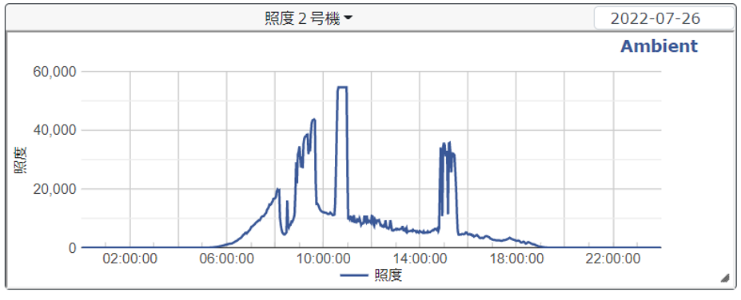
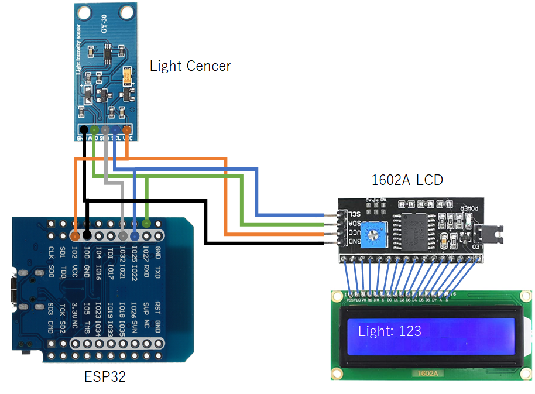
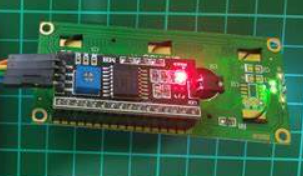
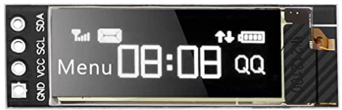
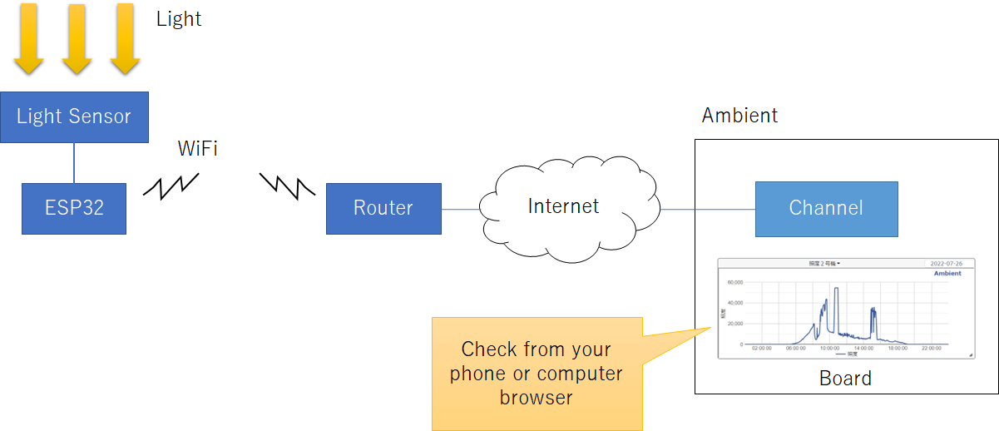
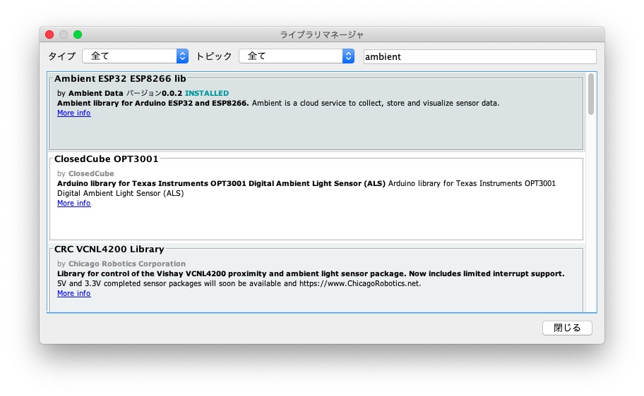
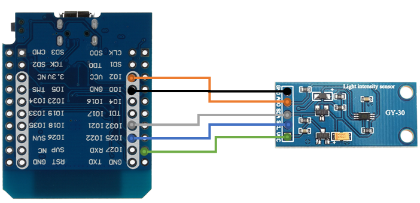
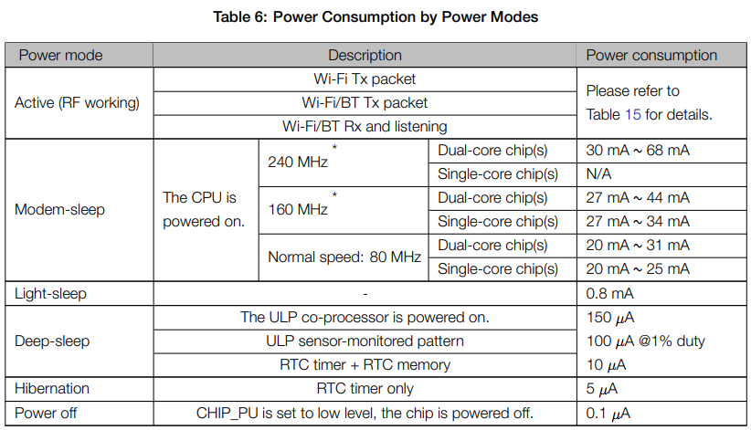
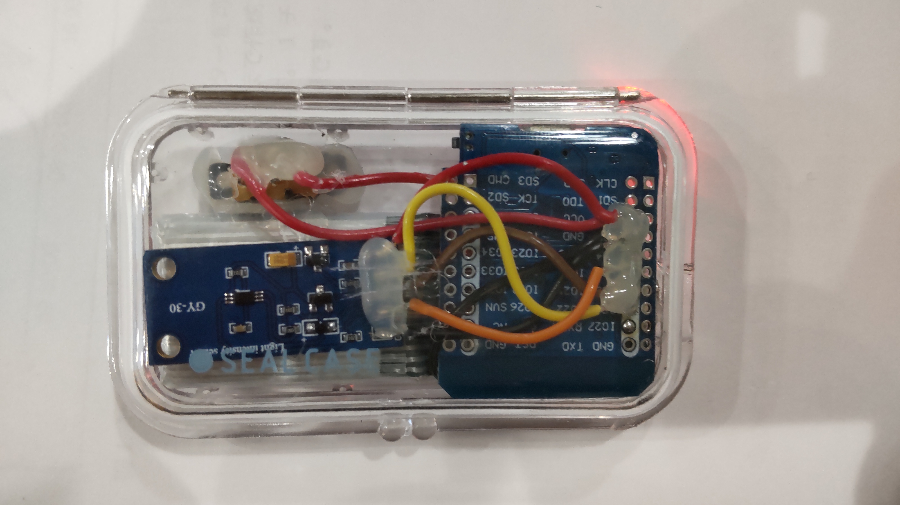
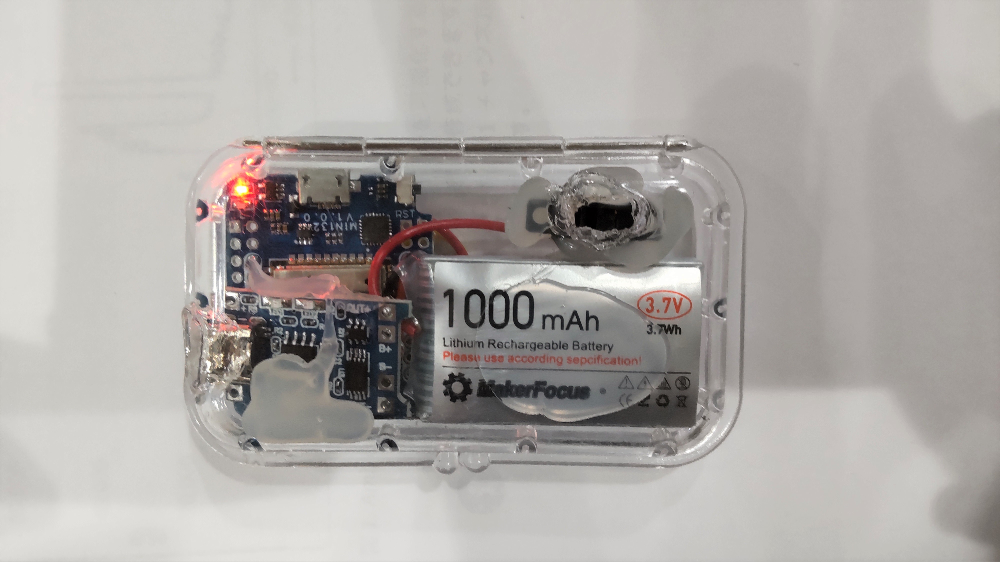

include::setting.adoc[]

= Light Cencer on ESP32

== Introduction

First, we will introduce how to read the illuminance sensor value and display it on the display using "<<Display on LCD Display>>".

At first, we were visually checking the display every 5 minutes and recording the data, but this was too much work, so we considered whether it would be possible to record the data automatically.
We found a free IoT data visualization service called Ambient. With this service, the illuminance is automatically recorded and can be checked graphically on a browser as shown in Figure 1. This method is introduced in "<<Automatic Illuminance Recording and Graphical Confirmation>>".
This method does not require a display, so the system can be built inexpensively.

.Graph display on the web with Ambient

NOTE: https://ambidata.io/[Ambient] is a service for visualizing IoT data and user registration is free. Each user can create up to 8 channels, meaning that data can be sent from 8 devices at once.
Each channel can register up to 3,000 data items per day. Storage period is 1 year.

== Display on LCD display

.Configuration diagram

NOTE: The 1602A LCD can be connected directly to the ESP32, but the wiring will be complicated, so we will use an I2C conversion adapter. The conversion adapter and display should be soldered together. In the figure, they are connected on the front side for clarity, but it is more compact to connect them on the back side.

.I2C Conversion Adapter and Display Connection

NOTE: If the display does not appear, adjust the variable resistor (in blue in Figure 3) on the I2C conversion adapter.

=== List of materials

The following is a list of required materials. However, the development board must be powered via micro USB. If you want to operate the board in a place without a power supply, you will need to prepare a mobile battery or the like separately. A 1,000mAh mobile battery will last about 3 to 5 days. If the device is to be placed under the blazing sun, it is better to use one that generates little heat.

.Materials List
|====
|Display|WayinTop 1602 LCD Display module|920yen
|Development Board|https://www.amazon.co.jp/gp/product/B08PNWB81Z/ref=ppx_yo_dt_b_search_asin_title?ie=UTF8&psc=1[ESP-WROOM-32 (5 pieces)]|4,799 yen (1 piece) 4,799 yen (959.8 yen per unit)
|illuminance sensor| https://www.amazon.co.jp/KKHMF-GY-30-%E3%83%87%E3%82%B8%E3%82%BF%E3%83%AB%E5%85%89%E5%BC%B7%E5%BA%A6%E7%85%A7%E5%BA%A6%E3%82%BB%E3%83%B3%E3%82%B5-%E5%85%89%E3%82%BB%E3%83%B3%E3%82%B5%E3%83%A2%E3%82%B8%E3%83%A5%E3%83%BC%E3%83%AB-BH1750FVI/dp/B078S82XV7/ref=dp_prsubs_2?pd_rd_i=B078S82XV7&psc=1[GY-30]|193 yen
|====

.Prepare as needed.
|====
|wire|https://www.amazon.co.jp/gp/product/B07H769GTK/ref=ppx_yo_dt_b_asin_title_o06_s00?ie=UTF8&psc=1[jumper wire]|999 yen
|====

We used the above display, but the following is smaller and cheaper, so we would like to try this one next time.

https://www.amazon.co.jp/gp/product/B07FNFYZRV/ref=ppx_yo_dt_b_asin_title_o01_s00?ie=UTF8&psc=1[(Amazon) IIC I2C Serial OLED LCD Module I2C]

=== Program

Program the ESP32 on the development board to display the data read from the illuminance sensor on the display.

Use the Arduino IDE to write the program.

==== Installing the Arduino IDE

1. install Arduino IDE
+
Install the Aruduino IDE by referring to the following page.
+
Reference page:.
https://qiita.com/asagi_toyo/items/f5d07a6ed4d6667617f7 (Using ESP32 with Arduino IDE)
+
NOTE: Although the type of ESP32 listed in the Aruduino IDE insole instructions above is different, the exact same procedure can be used for installation. 2.

2. connect the ESP32 to the PC
+
NOTE: The ESP32 is connected to the computer.
Connect the ESP32 to the PC. 3.

3. write to ESP32
+
Connect the ESP32 to your computer.
Write the following source code to ESP32 in the Arduino IDE.
+Write the following source to the ESP32 using the Arduino IDE.
+
[source,c]
+
.light_and_display
....
#include <Wire.h>
#include <BH1750FVI.h>
#include <LiquidCrystal_I2C.h>

LiquidCrystal_I2C lcd(0x27,16,2);

// Settings
uint8_t ADDRESSPIN = 27;
BH1750FVI::eDeviceAddress_t DEVICEADDRESS = BH1750FVI::k_DevAddress_H;
BH1750FVI::eDeviceMode_t DEVICEMODE = BH1750FVI::k_DevModeContHighRes;

// Create the Lightsensor instance
BH1750FVI LightSensor(ADDRESSPIN, DEVICEADDRESS, DEVICEMODE);

void setup() 
{
  Serial.begin(9600);
  delay(1000);
  
  LightSensor.begin(); //Start light sensor
  
  lcd.init(); // LCD initialization 
  lcd.backlight(); // turn on backlight
}

void loop()
{
  uint16_t lux = LightSensor.GetLightIntensity();
  lcd.clear(); // clear
  lcd.setCursor(0, 0); // cursor position
  lcd.print("Light: ");
  lcd.print(lux);

  // To check the value from the serial monitor of Arduino IDE
  Serial.print("Light: "); 
  Serial.println(lux);

  // Repeat every 3 seconds
  delay(3000);
}
....

== Automatic Illuminance Recording and Graphical Confirmation

ESP32 can use Bluetooth and WiFi. As shown in the figure below, ESP32 is connected via WiFi and data is stored in Ambient on the Internet. The stored data can be checked by displaying it as a graph on a smartphone or PC browser.

.Configuration for visualization in Ambient

A tutorial is available on the official Ambient page.
For instructions on how to register Ambient, see the following section of this tutorial.
https://ambidata.io/docs/gettingstarted/ (Try using Ambient)

=== Install Ambient libraries

Reference: https://ambidata.io/docs/esp8266/ (measuring temperature and humidity with an Arduino ESP8266 and sending it to Ambient for graphing)

To develop the program, first install the Ambient library in your own development environment: start the Arduino IDE, select "Manage Libraries..." from the "Tools" menu, and launch the Library Manager. Type "ambient" in the search window and install the "Ambient ESP32 ESP8266 lib" that appears.

=== Wiring

=== Program.

[source,c]
.light_ambient_and_display.ino
....
#include <Wire.h>
#include <BH1750FVI.h>

#include "Ambient.h"

#define uS_TO_S_FACTOR 1000000ULL
#define TIME_TO_SLEEP 120 // Set interval to send in seconds

// ↓ Set up WiFi here
const char* ssid = "WiFi identification number"; <1>
const char* password = "Wifi password"; <1>

// ↓ Set channel and write key
const int channelId = Ambient channel number; <2>
const char* writeKey = "Ambient's write key"; <2>

const boolean displayMode = true;

// Settings
uint8_t ADDRESSPIN = 27;
BH1750FVI::eDeviceAddress_t DEVICEADDRESS = BH1750FVI::k_DevAddress_H;
BH1750FVI::eDeviceMode_t DEVICEMODE = BH1750FVI::k_DevModeContHighRes;

// Create the Lightsensor instance
BH1750FVI LightSensor(ADDRESSPIN, DEVICEADDRESS, DEVICEMODE);

WiFiClient client;
Ambient ambient;

RTC_DATA_ATTR int bootCount = 0; // allocate variable in RTC slow memory

boolean flag = false;

void setup() 
{
  Serial.begin(9600);
  // wait for serial initialization only for initial startup
  if( bootCount == 0 ){
      delay(1000);
  }
  bootCount = 1;
  
  Serial.println("WiFi connecting....") ;
  WiFi.begin(ssid, password); // initialize Wi-Fi
  LightSensor.begin(); //Start light sensor
  while (WiFi.status() ! = WL_CONNECTED) { //wait for connection to Wi-Fi access point
      WiFi.begin(ssid, password); // initialize Wi-Fi
      delay(1000);
  }
  Serial.println("WiFi connected!!!") ;
  ambient.begin(channelId, writeKey, &client);

  uint16_t lux = LightSensor.GetLightIntensity();
  Serial.print("Light: ");
  Serial.println(lux);
  
  /* Check if a reading was taken */
  if (isnan(lux)) {
    Serial.println("Read failure!");
  } else {
  /* Send data to Ambient */
  ambient.set(1, lux);
  ambient.send();
    
  Serial.println("Sent to Ambient");
    
  esp_sleep_enable_timer_wakeup(TIME_TO_SLEEP * uS_TO_S_FACTOR);

  esp_deep_sleep_start();
  }
}

void loop()
{
}
....
<1> Set the Wifi identifier and password.
<2> Set Ambient channel number and write key (like password).

=== Energy saving

When it was on display, we didn't have to worry about the battery so much because we could just replace it when it ran out because we were visually watching it. However, when recording automatically, the ESP32 will be running for a long time, so it is important to save energy.
The ESP32 has a Deep Sleep mode in addition to the normal sleep mode. This Deep Sleep is 10 µA to 150 µA as shown below, which is considerably smaller than the normal sleep of 20 mA to 30 mA.

Reference: https://flogics.com/wp/ja/2019/12/investigated-esp32-power-consumption-of-ble/

In the program, Deep Sleep is initiated at the following location.

[source,c]
....
  esp_sleep_enable_timer_wakeup(TIME_TO_SLEEP * uS_TO_S_FACTOR);

  esp_deep_sleep_start();
....

When Deep Sleep is performed, setup() is called again after sleep. For this reason, loop() is not executed, so all processing should be written in setup().

== To avoid running out of battery power

You can use a USB mobile battery to share power to the ESP32, but it will stop when the battery runs out.

If you use a pass-through battery, you can keep the ESP32 running while charging it, but pass-through batteries are more expensive than 100-yen batteries.

To solve this problem, we used a lithium battery charger module and a lithium battery.
Lithium batteries can be used as long as they are 3.7 V. Search Amazon for "lithium battery 3.7 V" and you will find a variety of lithium batteries.

.Configuration diagram with battery module
image:battery.png[]

.Materials for using battery module
|====
|3.7V lithium battery|https://www.amazon.co.jp/%E3%83%AA%E3%83%81%E3%82%A6%E3%83%A0%E3%82%A4%E3%82%AA%E3%83%B3%E3%83%90%E3%83%83%E3%83%86%E3%83%AA-Vivan-Star-ESP32%E9%96%8B%E7%99%BA%E3%83%9C%E3%83%BC%E3%83%89%E7%94%A8%E4%BF%9D%E8%AD%B7%E3%83%9C%E3%83%BC%E3%83%89-1-25%E3%83%97%E3%83%A9%E3%82%B0%E4%BB%98%E3%81%8D3-7V-1100mAh%E3%83%AA%E3%83%81%E3%82%A6%E3%83%A0%E5%85%85%E9%9B%BB%E5%BC%8F%E3%83%90%E3%83%83%E3%83%86%E3%83%AA%E3%83%BC1S/dp/B08689FZGT/ref=sr_1_31?keywords=3.7v+%E3%83%AA%E3%83%81%E3%82%A6%E3%83%A0%E3%83%90%E3%83%83%E3%83%86%E3%83%AA%E3%83%BC&qid=1662882439&sr=8-31[Lithium-ion battery 1100mAh (4 pcs)]|2,098 yen (524 yen / piece)
|Lithium battery charger module|https://www.amazon.co.jp/gp/product/B07QTQ46XN/ref=ppx_yo_dt_b_asin_title_o02_s00?ie=UTF8&psc=1[TP4056 Type-C USB 5V 1 A (10 pieces)]|999 yen (100 yen / piece)
|Slide switch|https://www.amazon.co.jp/ELPA-HK-SLS01H-%E3%82%B9%E3%83%A9%E3%82%A4%E3%83%89%E3%82%B9%E3%82%A4%E3%83%83%E3%83%81-1%E5%9B%%9E%E8%B7%AF2%E6%8E%A5%E7%82%B9/dp/B00BECS5A0/ref=sr_1_5?__mk_en_JP=%E3%82%AB%E3%82%BF%E3%82%AB%E3%83%8A&keywords=%E3%82%B9%E3%83%A9%E3%82%A4%E3%83%89%E3%82%B9%E3%82%A4%E3%83%83%E3%83%81&qid=1662883368&s=diy&sr=1-5[Slide switch 1 circuit 2 contacts HK-SLS01H (2 pieces)]|171yen
|====

The following is how it looks like in a 100-yen seal case.

.Surface

.Back side

